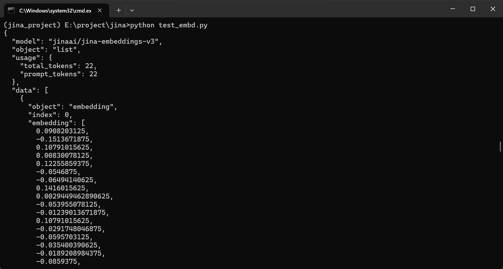

# API文档

## 1. 接口概述

- 接口描述: `Jina-embeddings-v3` 模型本地 API 接口，用于将文本列表转换为向量列表。
- 请求路径: `http://127.0.0.1:8000/embd`
- 请求方法: `POST`

## 2. 请求 (Request)

- 请求格式: `application/json`
- 请求参数说明:  (基于 ApiRequest 类)

| **参数名** | **类型** | **默认值** | **参数说明** |
| --- | --- | --- | --- |
| `input` | `array (string)` | `N/A` | 需要被转换成向量的字符串列表 |
| `model` | `string` | `None` | 模型名称 `jinaai/jina-embeddings-v3` |
| `task` | `string` | `None` | 任务类型 |
| `dimensions` | `integer` | `None` |  输出维度 |
| `embedding_type` | `string` | `None` |  Embedding 类型 |
| `truncate` | `boolean` | `None` |  是否截断 |
| `late_chunking` | `boolean` | `None` | 是否晚分块 |
- 请求样例:JSON
    
    ```
    data_to_send = {
            "model": "jina-embeddings-v3",
            "task": "text-matching",
            "input": [
                "你好，我是测试客户端",
                "我正在调用你本地的服务器"
            ]
        }
    ```
    

## 3. 响应 (Response)

- 响应格式: `application/json`
- 响应参数说明:

| **参数名** | **类型** | **参数说明** |
| --- | --- | --- |
| `model` | `string` | 所使用的模型名称 (e.g., "jinaai/jina-embeddings-v3")。 |
| `object` | `string` | 响应类型，恒定为 `"list"`。 |
| `usage` | `object` | 包含 Token 数量的对象。 |
| `usage.total_tokens` | `integer` | 本次请求消耗的总 Token 数。 |
| `usage.prompt_tokens` | `integer` | 本次请求的提示 Token 数 (同 `total_tokens`)。 |
| `data` | `array (object)` | 包含 embedding 结果的列表。 |
| `data[].object` | `string` | 数据类型，恒定为 `"embedding"`。 |
| `data[].index` | `integer` | 向量在原始 `input` 列表中的索引号。 |
| `data[].embedding` | `array (number)` | 浮点数向量本身。 |
- 响应样例:JSON
    
    
    

```json
{
  "model": "jinaai/jina-embeddings-v3",
  "object": "list",
  "usage": {
    "total_tokens": int,
    "prompt_tokens": int
  },
  "data": [
    {
      "object": "embedding",
      "index": 0,
      "embedding": [
        ...
      ]
    },
    {
      "object": "embedding",
      "index": 1,
      "embedding": [
        ...
      ]
    }
  ],
}
```
